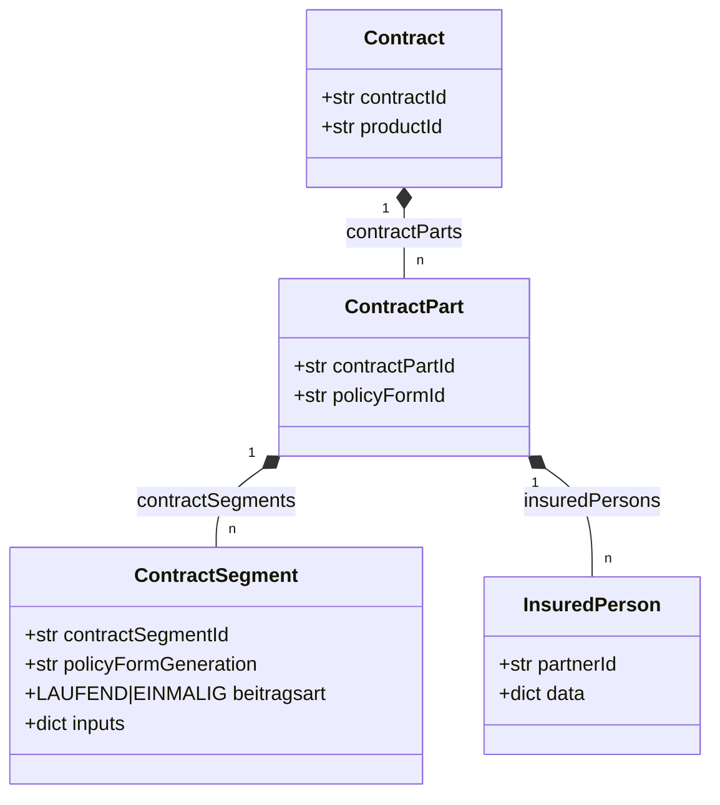
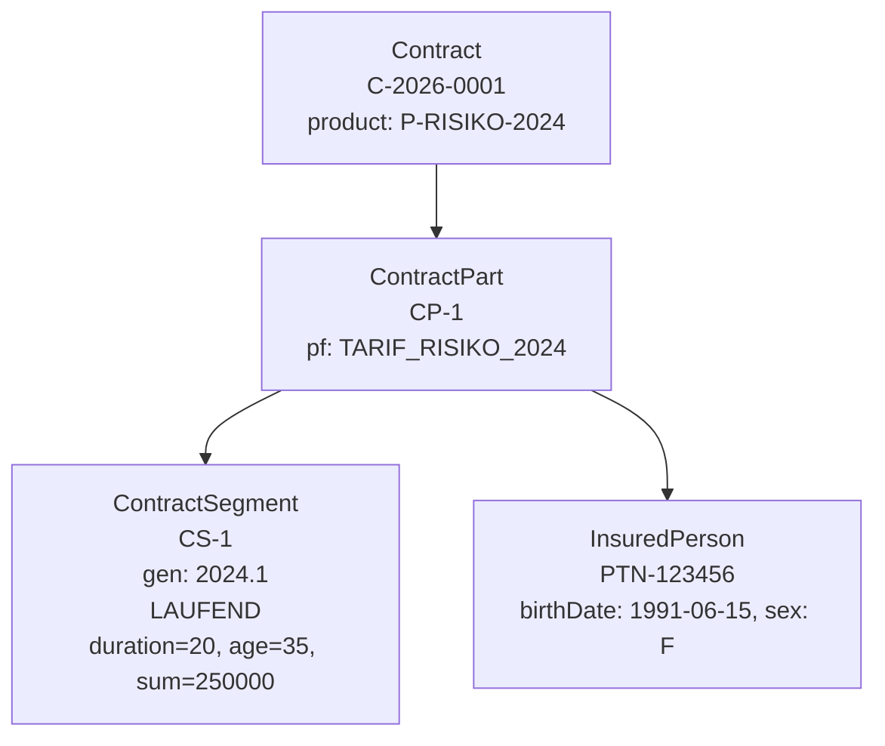
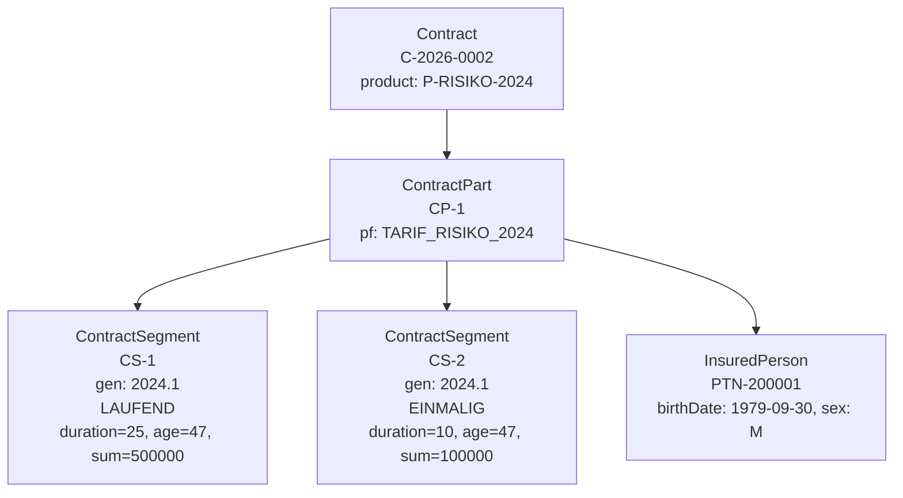

# Policy Administration System

Vertragsstrukturen — automatisch generiert aus `policy-admin`.

---

=== Schema

# Contract-Schema

<!--notes:
Quelle: src/policy_admin/contract/models.py — die pydantic-Modelle sind die
single source of truth. Dieses Diagramm wird per Reflection erzeugt.
-->

---

=== Beispiel-Verträge

# Beispiel: C-2026-0001

---

# Beispiel: C-2026-0002

