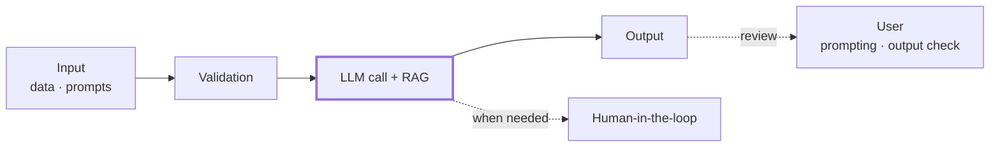
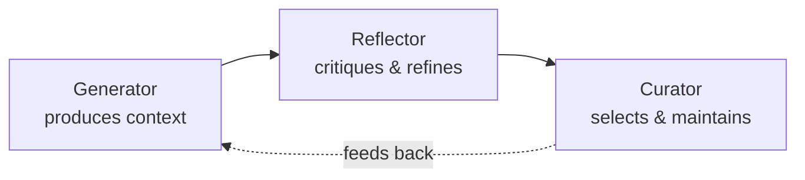

<!--bg: Gemini_Generated_Image_7omn3y7omn3y7omn.png-->

# Update AI @ msg life

*Where we stand with AI — an overview in four chapters*

<!--notes:
Opening slide for the whole "Update AI" arc.
After this slide the app auto-inserts the global agenda listing the four chapters.
Each chapter then opens with its own divider slide and a chapter agenda (background image).
-->

---

=== A Regulatory-Compliant Architecture for Life Insurance

<!--bg: Gemini_Generated_Image_7omn3y7omn3y7omn.png-->

# A Regulatory-Compliant Architecture for Life Insurance

1. **Regulation** — GDPR, EU AI Act, compliance / antitrust, IP rights
2. **Security & cloud** — DORA, availability, performance
3. **Build vs. Run** — the simplifying lens
4. **Standard software** — a two-part Build for life insurers

<!--notes:
Chapter opening on one slide: background image + chapter title + its agenda.
Source: Update-AI.md → "Eine regulatorisch konforme Architektur für die LV".
-->

---

# Two foundations before autonomy

<span style="font-size: 1.3em;">(Semi-)autonomous, **agentic** AI in life insurance only works on solid ground.<br>
Two foundations come first:</span>

- **Regulation** — what the law lets the AI see and decide
- **Security** — most AI runs in the cloud, so cloud risk *is* AI risk

<span style="font-size: 1.3em;">Get these right and a **simplifying lens** follows: cleanly separate **Build** from **Run**.</span>

<!--notes:
Opening of Chapter 1. Sets up the agenda threads: Regulation, Security, Build/Run, Standard software.
-->

---

# The regulatory frame

<span style="font-size: 1.3em;">For life insurance, four bodies of rules shape what agentic AI may do:</span>

- **GDPR** — which personal data the agent may process
- **EU AI Act (KI-VO)** — risk class, obligations, prohibited uses
- **Compliance & antitrust** — Antitrust law and market conduct
- **IP rights** — ownership of generated artifacts and of training inputs

<!--notes:
Regulatorik aus der Outline: DSGVO, KI-VO, Compliance/Kartellrecht, IP-Rechte.
-->

---

# Security is cloud security

<span style="font-size: 1.3em;">Most AI workloads run in the **cloud** — so the cloud's risks become the AI's risks.</span>

- **DORA** — operational resilience for financial entities
- **Availability & performance** — the agent layer must not become the weak link
- **General IT security** — data protection, access control, isolation

<span style="font-size: 1.3em;">Regulation and plain IT engineering meet here.</span>

<!--notes:
Security-Teil: Cloud, DORA, Verfügbarkeit/Performance/Sicherheit.
-->

---

# The simplifying lens: Build vs. Run

<span style="font-size: 1.3em;"> A clean separation of **Build** and **Run** makes the discussion tractable.</span>

- In **Build**, agentic AI is increasingly used in SWE — but it mostly produces **rule-based code** (Python, Java)
- The engineering process is **not fundamentally different** from the conventional one: under **human oversight**, artifacts are produced wholly or partly by agents
- At the end stand **extensive quality-assurance** measures

<span style="font-size: 1.3em;">→ The genuinely new governance questions live in **Run** (see Chapter 4).</span>

<!--notes:
Build/Run-Trennung als Vereinfachung. Verweist nach vorne auf Kapitel 4 (Run).
-->

---

# Standard software: a two-part Build

<span style="font-size: 1.3em;">Developing **standard software** for life insurers splits the Build process in two:</span>

1. **Building the standard software** for life insurance — the shared product
2. **Customizing it & developing products** — done by the individual insurer (LV)

<span style="font-size: 1.3em;">This is the **Shared industry commons** layer from the architecture picture:<br>
one common core, many insurer-specific configurations on top.</span>

<!--notes:
Neuer Outline-Teil "Besonderheiten für die Entwicklung von Standardsoftware":
Build zerfällt in (1) Standardsoftware-Entwicklung, (2) Customizing/Produktentwicklung durch die LV.
"Shared industry commons" = Begriff aus dem Architekturbild.
-->

---

# The architecture at a glance

<style>.arch-fit img { max-height: 58vh; margin: 0.4em auto; }</style>
<div class="arch-fit">


</div>

<!--notes:
Architektur-Bild aus der Galerie (Architektur.png). Zeigt die Standardsoftware-Schicht
mit "Shared industry commons", auf die die vorige Folie verweist.
Bild wird über den exakten Dateinamen aus der Bild-Bibliothek aufgelöst.
Höhe per gescopetem .arch-fit-Style auf 58vh begrenzt, damit Titel + Bild ohne
Scrollen auf eine Folie passen (global ist .prose img sonst 80vh + 2em Margin).
-->

---

# Two concepts this raises

<span style="font-size: 1.3em;">The two-part Build makes two engineering concepts central:</span>

- **Continuous Delivery** — the standard software ships continuously, not in rare big-bang releases
- **Merge — standard release vs. customer** — each insurer's customizing must absorb new standard releases without losing local changes

<span style="font-size: 1.3em;">Agentic AI has to respect **both** lines of change — standard and customer.</span>

<!--notes:
Outline: Continuous Delivery; Merge (Standardrelease vs. Customer) — beide Begriffe müssen adressiert werden.
-->

---

=== Agentic Knowledge Management

<!--bg: Gemini_Generated_Image_7omn3y7omn3y7omn.png-->

# Agentic Knowledge Management

1. **msg.ask:it** — where we stand today
2. **Integration** — into workflows and connected to applications
3. **Agentic Context Engineering** — self-learning machines
4. **Regulation** — notes and constraints

<!--notes:
Chapter opening on one slide: background image + chapter title + its agenda.
Source: Update-AI.md → "Agentisches Wissensmanagement".
-->

---

# msg.ask:it — where we stand today


<!--notes:
Bild askit.png aus der Galerie (über exakten Dateinamen aufgelöst). Zeigt den
aktuellen Stand von msg.ask:it — Agenda-Punkt 1 dieses Kapitels.
Falls zu groß: per gescopetem .arch-fit-Style auf z.B. 58vh begrenzen (siehe README).
-->

---

# From chatbot to domain assistant

<span style="font-size: 1.3em;">ask:it moves from simple chatbots to **integrated, source-based assistants**:</span>

- **Domains, not chats** — a domain holds all approved documents; alongside **DAV**, a **Regulation** domain is set up
- **Source-based** — every answer **references its sources**; connects to applications
- **Agent-to-agent** — ask:it agents talk to agents in other systems (web, policy admin, Jira, code repos, intranet)
- **Multilingual** — UI and documents; always the best available LLMs (price/performance)

<!--notes:
Aus PPTX-Folie 3: Übergang Chatbot→integrierte Assistenten, Domänen (DAV, Regulation),
quellenbasiert, Agent-zu-Agent, mehrsprachig, beste Modelle.
-->

---

# The user stays in control

<span style="font-size: 1.3em;">The user sets the terms of every query:</span>

- **Context** — "where do I search?", plus depth, format and required **reliability**
- **Personas** — **Luna** for fast, domain-focused search · **Dex** for deep, detailed analysis
- **Personal Domain** — bring your own documents; domains can be **temporarily combined**
- **Glossary & filters** — domain terms and preset filters keep answers precise

<!--notes:
Aus PPTX-Folie 3: Nutzer bestimmt Kontext/Verlässlichkeit/Tiefe/Format; Personas Luna/Dex;
Personal Domain, temporäres Verbinden; Glossar & Filter.
-->

---

# Source-based — and auditable by design

<span style="font-size: 1.3em;">ask:it's promise is **source-based answers**. Here is the processing chain behind them:</span>



<div style="font-size: 1.3em;">

The **RAG pipeline** behind it: ① Chunking → ② Embedding → ③ Metadata → ④ Vector DB.

**Data lineage & audit trail** span the whole chain — auditability by design.

</div>

<!--notes:
Verarbeitungskette des Wissensmanagements (vormals in Kapitel 1, dorthin gehörte nur die
allgemeine Regulatorik/Datenkategorien): Eingabe→Validierung→LLM/RAG→Ausgabe, Nutzer prüft
Ausgaben, Human-in-the-Loop; RAG-Pipeline (Chunking/Embedding/Metadaten/VektorDB);
Audit-Trail/Data-Lineage. Schließt den ask:it-Fundament-Block ab, bevor ACE beginnt.
-->

---

# Agentic Context Engineering (ACE)

<div style="font-size: 1.3em;">

A major step forward for **all** chatbots — worldwide, not just our industry.

But for **life insurance** it matters especially: intangible products and heavy regulation raise the stakes.

The core idea: **self-learning** in communication — **human ↔ machine** *and* **machine ↔ machine**.

</div>

<!--notes:
ACE als branchenübergreifende Weiterentwicklung, in der LV besonders relevant
(immaterielle Güter, starke Regulierung). Kerngedanke: self-learning in der Kommunikation.
-->

---

# ACE in the words of the research (Quote from Stanford University, 10/2025)


*Quote from a Stanford University paper, 10/2025.*

<!--notes:
Bild agentic_context_engin.png aus der Galerie — ein Zitat aus einem Paper der
Stanford University (10/2025). Wird über den exakten Dateinamen aus der Bild-Bibliothek aufgelöst.
-->

---

# What ACE actually is

<div style="font-size: 1.3em;">

**Context engineering** = (partially) autonomous methods that improve a model's behavior by **creating, modifying and managing additive, natural-language context** for an LLM — **not by changing its weights**.

</div>

- Contexts are **interpretable**
- They allow **rapid integration** of new knowledge
- They can be **shared across models**

<!--notes:
Aus PPTX-Folie 4: präzise ACE-Definition (additive natürlichsprachige Kontexte statt
Gewichtsänderung; interpretierbar, schnell integrierbar, modellübergreifend teilbar).
-->

---

# Why we avoid fine-tuning

<span style="font-size: 1.3em;">In most applications we have deliberately **not** fine-tuned. Two reasons:</span>

- **Cost** — training and maintaining tuned models is expensive
- **Regulation & compliance** — fine-tuning on customer data would bake **company-specific, personal context** into the model

<span style="font-size: 1.3em;">That is **not permitted**: we must guarantee customers that **their data is never used for training**.</span>

<!--notes:
Begründung gegen fine-tuning: Kosten + Regulatorik. Training/fine-tuning auf Kundendaten
würde unternehmensspezifische Kontexte ins Modell integrieren — nicht erlaubt.
Garantie an Kunden: keine Trainings mit ihren Daten.
-->

---

# RAG closes only part of the gap

<span style="font-size: 1.3em;">To bring in current knowledge **without** training, we have used **RAG**.</span>

- It works well — **but only for knowledge already documented** in some form
- Knowledge that emerges **in the conversation** with the bot is regularly **lost**

<span style="font-size: 1.3em;">→ A gap remains between what the bot learns in dialogue and what it can reuse.</span>

<!--notes:
RAG integriert aktuelles Wissen ohne Training, funktioniert aber nur bei bereits
dokumentiertem Wissen. Wissen aus der Bot-Kommunikation geht verloren.
-->

---

# What ACE promises

<span style="font-size: 1.3em;">ACE finally offers a new path to that lost knowledge:</span>

- **Self-learning** from the dialogue itself — human ↔ machine and machine ↔ machine
- Captures context **without** training the model on customer data
- Learned context stays **isolated per customer** — one tenant's dialogue never informs another's answers
- The system **gets better with use** while the regulatory guarantee stays intact

<span style="font-size: 1.3em;">→ **Self-learning machines** — within the life-insurance compliance frame.</span>

<!--notes:
ACE als neuer Zugang zu dem bislang verlorenen Wissen aus der Kommunikation —
ohne Training auf Kundendaten, Regulatorik-Garantie bleibt erhalten.
-->

---

# The ACE framework

<span style="font-size: 1.3em;">Inspired by the *Dynamic Cheatsheet*, ACE uses an agentic architecture of **three specialized roles**:</span>



<span style="font-size: 1.3em;">The loop keeps the natural-language context **useful, current and compact**.</span>

<!--notes:
Aus PPTX-Folie 6: ACE-Framework mit Rollen Generator / Reflector / Curator,
inspiriert vom "Dynamic Cheatsheet". Natives Mermaid-Diagramm.
-->

---

# ACE meets Knowledge Graphs

<span style="font-size: 1.3em;">Decades of **neurosymbolic** research point the same way: combine symbolic and neural approaches in **hybrid, modular** systems — symbols give **abstraction**.</span>

- **Knowledge Graphs** serve as **symbolic memory** and a **rule repository**
- Especially valuable in deep, domain-specific work — e.g. **product development**
- Self-learning spans **human ↔ machine** and **machine ↔ machine**

<span style="font-size: 1.3em;">→ ACE + KGs: the bridge from conversation to durable, reusable knowledge.</span>

<!--notes:
Aus PPTX-Folie 4: Knowledge Graphs / Neurosymbolik — KGs als symbolisches Gedächtnis
und Regel-Repository, relevant in Produktentwicklung; Integration ACE + KGs.
-->

---

=== Automating Business Processes

<!--bg: Gemini_Generated_Image_7omn3y7omn3y7omn.png-->

# Automating & Flexibilizing Business Processes

1. **msg.process:it** — where we stand today
2. **Integration** — with AF and ask:it
3. **Conversational AI**
4. **Regulation** — a low-risk autonomous agent

<!--notes:
Chapter opening on one slide: background image + chapter title + its agenda.
Source: Update-AI.md → "Automation und Flexibilisierung von Geschäftsvorfällen".
-->

---

# msg.process:it — orchestrating end to end

<span style="font-size: 1.3em;">AI agents orchestrate business processes **end-to-end**, (semi-)autonomously — steered in **human language**, not in rule-based code.</span>

- Agents **know the processes** they can run — and their APIs — and do the **mapping themselves**
- They **execute** the process, process the results, and **close the case**

<!--notes:
Punkt 1 aus processit.md: Agenten orchestrieren Prozesse E2E (teil-)autonom,
kennen Prozesse + API, machen das Mapping selbst, keine regelbasierte Implementierung.
-->

---

# The orchestration at a glance


<!--notes:
Bild processit.png aus der Galerie (über exakten Dateinamen aufgelöst).
Falls zu groß: wie beim Architekturbild per gescopetem .arch-fit-Style auf z.B. 58vh begrenzen.
-->

---

# Agents fetch, understand, create

<span style="font-size: 1.3em;">When needed, the agent gathers and produces information:</span>

- **Analyze & verify external input** — email, chatbot, WhatsApp (e.g. by querying data)
- **Analyze internal data** — contract data, (intermediate) simulation results
- **Produce output** — reports, emails, closings, chatbot replies
- **Propose, support decisions, and document** them

<!--notes:
Punkt 2 aus processit.md: externe Eingaben analysieren/verifizieren, interne Daten
analysieren, Output erzeugen, Vorschläge machen und dokumentieren.
-->

---

# Automation with a human safety net

<span style="font-size: 1.3em;">When it matters, the AI agent **calls a human agent** and hands over all relevant context.</span>

- The goal: **automation** — plus a **perfect customer experience** (instant answers, 24×7)
- Optimal **scalability** — cloud-based, SaaS subscription, usage-based

<!--notes:
Punkt 3 aus processit.md: Human-in-the-Loop bei Bedarf; Automatisierung,
Kundenerlebnis 24x7, Skalierbarkeit, Cloud/SaaS/nutzenbasiert.
-->

---

# Demo: an additional payment, end to end

</span>Our standing live demo — a policyholder wants to **pay an additional amount** into their life policy:</span>

1. **Intake** — the request arrives in plain language (portal, email, chat): *"I'd like to pay €5,000 extra into my policy."*
2. **Understand & verify** — the agent identifies the policy, reads the contract data, checks the additional payment is **admissible** (tariff rules, limits)
3. **Simulate** — it calls the core to compute the **effect** (new benefit / sum insured, costs, tax view)
4. **Propose & confirm** — it explains the result in plain language; the customer confirms; **human-in-the-loop** where required
5. **Execute & document** — the core books the payment, the agent **closes the case** and writes the **audit trail**

→ One request, **end to end**: gathered, simulated, executed, documented.

<!--notes:
Konkretes Demo-Beispiel "Zuzahlung" (additional payment) — bevorzugte Übersetzung
"additional payment", nicht "top-up". Erdet die vier konzeptionellen Folien dieses
Kapitels (E2E-Orchestrierung, fetch/understand/create, Human-Safety-Net) an dem Fall,
der live gezeigt wird. Beträge/Felder beim echten Demo-Stand anpassen.
Die Simulation (Schritt 3) ruft den deterministischen Kern (gamma-lab/rechenkern).
-->
---

# Beyond policy administration

<span style="font-size: 1.3em;">It is not only about administration — **self-service and sales** systems too (possibly hybrid):</span>

- Built as **adaptable standard software** (cost-sharing)
- Goal: cover the **whole policy lifecycle** step by step — **pain points first**
- **Customizing by experts** — requirements written in human-readable text
- Sits **on top of rule-based business processes** (e.g. **AF**)

<!--notes:
Punkt 4 aus processit.md: nicht nur Bestandsführung; Selfservice/Vertrieb;
anpassbare Standardsoftware (Cost-Sharing); ganzer Policen-Lebenszyklus, Pain-Points zuerst;
Customizing durch Experten; setzt auf regelbasierten Gevos (AF) auf.
-->

---

# Regulation: a low-risk autonomous agent

<span style="font-size: 1.3em;">The orchestration is designed as a **low-risk AI system** — an autonomous agent with **no risk assessment** and **no pricing**.</span>

- **Purpose** (Art. 3(12) AI Act) — agentic steering of insurance processes and customer communication through to execution
- **Out of scope** of Annex I + III; **no** risk rating or pricing (Recital 58)
- **Autonomy** (Art. 3(1)) — level 5, full automation: runs its mission without external intervention
- **Transparency** (Art. 50(5)) — the policyholder is told at first contact that they interact with an AI system

<!--notes:
Aus PPTX-Folie 2: Einordnung als KI-System mit geringem Risiko; KI-VO-Bezüge
(Zweckbestimmung Art. 3 Nr. 12, Anhang I+III/ErwGr 58, Autonomiegrad Art. 3 Nr. 1,
Transparenz Art. 50 Abs. 5).
-->

---

# Regulation: data protection & duties

- **Legal basis** (Art. 6(1)(b) GDPR) — performance of the contract
- **Data-subject rights** (Art. 22 GDPR) — the right to obtain **human intervention** (case handling)
- **Security of processing** (Art. 32 GDPR) — **audit logs**: who accessed or transmitted which customer data, and when
- **Advice & documentation duties** (Art. 61, 62 VVG) — every advisory step, the proposed changes, their effects and rationale, fully evidenced (audit trail)

<!--notes:
Aus PPTX-Folie 2: DSGVO (Art. 6 Abs. 1b Rechtsgrundlage, Art. 22 Betroffenenrechte,
Art. 32 Sicherheit/Audit-Logs) und VVG (Art. 61, 62 Beratungs-/Dokumentationspflichten).
-->

---

# 🚧 Still to come in this chapter

One thread is still being reworked:

- A dedicated look at **Conversational AI**

<!--notes:
Platzhalter für den noch offenen Agenda-Punkt Conversational AI.
-->

---

=== Software Engineering & Product Development

<!--bg: Gemini_Generated_Image_7omn3y7omn3y7omn.png-->

# Agents Across Build and Run

<span style="font-size: 1.3em;">**Build — developing the product**</span>

1. From code generation to product management
2. The product lifecycle, end to end
3. Standard product + customer customizing
4. Specialized agents, standardized practice
5. A maturity model

<span style="font-size: 1.3em;">**Run — operating the product**</span>

6. The deterministic core meets the conversational layer
7. Use cases, governance & outlook

<!--notes:
Chapter opening on one slide: background image + chapter title + its agenda.
Two-part chapter: Build (product development with agents) then Run (agents + core systems).
Build half draws on gamma-lab docs/prozess/E2E-AutomationProduktmanagement.md.
-->

---

# Build vs. Run — a clean separation

<span style="font-size: 1.3em;">A recurring theme of this update: **separate Build from Run.**</span>

- **Build** — agents help create code, tests, docs, architecture. Output is largely *deterministic, rule-based* software (Python, Java).
- **Run** — the system is *in production*, running real business processes.

This chapter covers **both halves**. First **Build** — how agents now span the *entire* product-development lifecycle, not just code. Then **Run** — what happens when conventional core systems and AI agents operate **side by side** in live operations.

<!--notes:
Anchor back to Chapter 1 (regulatorisch konforme Architektur) and the Build/Run argument.
This slide is the chapter bracket: it sets up both the Build block (next slides) and the Run block (later).
-->

---

# Build — from code generation to product management

<span style="font-size: 1.3em;">The headline used to be "AI writes code." That undersells it.</span>

- **Today:** Claude Code automates large parts of the **SWE** process.
- **Tomorrow:** agents accompany the **entire product-management** lifecycle — idea, requirements, design, implementation, test, docs, operations, compliance, EOL.

<span style="font-size: 1.3em;">Generating code is now just **one building block**. Under **Human-on-the-Loop**, agents create, review and extend requirements, ADRs, test suites, manuals — *and* code. Every change touches the whole cycle.</span>

<!--notes:
Source: gamma-lab docs/prozess/E2E-AutomationProduktmanagement.md ("Zielsetzung").
Key reframing: code generation is necessary but no longer the differentiator.
-->

---

# The product lifecycle, end to end

<span style="font-size: 1.3em;">A full process runs far beyond implementation:</span>

<style>.lifecycle-cols { display: flex; gap: 3em; } .lifecycle-cols > div { flex: 1; } .lifecycle-cols ol { margin: 0.2em 0; }</style>
<div class="lifecycle-cols">
<div>

1. Discovery — market, competition, regulation
2. Idea & roadmap — portfolio, prioritization
3. Requirements — user stories, acceptance criteria
4. Design & architecture — ADRs, security model
5. **Implementation — code, reviews**

</div>
<div>

6. **Test — unit, property, E2E, regression**
7. **Docs — manual, API, runbooks**
8. Operations — monitoring, incidents, improvement
9. Compliance — BaFin/VAIT, DSGVO, EU AI Act
10. Sunset / EOL — migrations, data export

</div>
</div>

*Bold = AI-supported **today**. The goal is all ten phases.*

<!--notes:
We are at maturity level 1-2 today (5, 6, partially 7). The arc of this block is "how do we get to the rest".
-->

---

# Two lifecycles: standard product + customer customizing

<span style="font-size: 1.3em;">The point most SWE talks omit — and it shapes everything (it picks up the Build split from Chapter 1):</span>

- We build **standard software** — one product for many customers.
- Customers **customize** it: configuration, extension, or their own code layer.

This creates a **dual lifecycle**:

<style>
.dual-life table { margin: 0.6em auto !important; }
.dual-life td:first-child { width: 40% !important; text-align: left !important; font-weight: 600; }
.dual-life td, .dual-life th { padding: 0.35em 0.9em !important; }
</style>
<div class="dual-life">

| Standard cycle | Customer-instance cycle |
|---|---|
| Releases of the product core | Customizing, upgrades, operations *per customer* |

</div>

The second cycle is **just as large** as the first, runs per customer, and lags the release cadence.

*Example `gamma-lab`: customer-layer formulas (RestrictedPython sandbox) are an override layer — customers replace default calculations without forking the standard.*

<!--notes:
This is the most distinctive slide of the Build block. Connect explicitly to Chapter 1's "Besonderheiten für Standardsoftware".
-->

---

# Release upgrade: standard → customer

Standard goes N → N+1, and customer instance must be upgraded:

```
Impact analysis → Merge → Test per instance → Customer sign-off → Deploy
```

*Note: this is a **code** upgrade of the customer layer — the insurer's contracts are never touched.*

Complexity is **N customers × M releases** — automation / scale.

**Where AI helps — strictly within one tenant:**

- **Merge proposals** — a **tenant-isolated** agent reconciles the new standard with *that customer's own* customizing — never across customers
- **Test synthesis** — regression tests derived from a single customer's customizing, run only against that instance
- **Release notes per tenant** — filtered to what affects that one customer
- **Upgrade-readiness score** per customer — how large the next jump will be

<!--notes:
This is the scaling argument: the customer pathway is where agentic automation earns its keep.
-->

---

# Specialized agents, not one universal agent

An E2E process needs a **role model** — a single code agent is not enough:

<style>
.agent-table table { margin: 0.5em auto !important; }
.agent-table td:first-child { width: 33% !important; text-align: left !important; font-weight: 600; }
.agent-table td, .agent-table th { padding: 0.28em 0.9em !important; }
</style>
<div class="agent-table">

| Role | Responsibility |
|---|---|
| **PM / BA** | Roadmap, requirements, acceptance criteria |
| **Architect** | ADRs, tech choice, security architecture |
| **Dev** | Implementation (today: Claude Code) |
| **Test / Doc** | Property & E2E tests · manual, API, runbooks |
| **Ops / Compliance** | Monitoring, incidents · BaFin/DSGVO checks |
| **Release / Upgrade** | Standard packages · per-customer merge & conflict resolution |
| **Tenant-Ops / Success** | Per-tenant health & capacity · roadmap communication |

</div>

Each agent has a **skill** (markdown) and shares **memory** + **MCP connectors**. Standardized via **templates, skills, hooks, quality gates** (Definition of Ready / Done / Compliance).

<!--notes:
Source: agent topology table. The right two rows are the customer-pathway-specific agents.
-->

---

# A maturity model — in two dimensions

<style>
.maturity-table table { margin: 0.5em auto !important; }
.maturity-table td, .maturity-table th { padding: 0.3em 0.9em !important; }
</style>
<div class="maturity-table">

| Level | Runs with AI | Human decides |
|---|---|---|
| 1 | SWE (code, test, PR) | Everything else |
| 2 | + Docs | Releases, compliance |
| 3 | + Requirements, ADR drafts | Review before implementation |
| 4 | + Ops (incidents, alerts) | Critical escalations |
| 5 | + Discovery, portfolio, customer-upgrade merges | Only at HITL gates |

</div>

**Two pathways mature on different clocks:** standard path is at **level 1–2** today, the customer path at **0–1** (upgrades, merges still manual).

→ Hypothesis: **level 4 in both** by end of 2026. **Pilot domain: `gamma-lab`** — in production, clear compliance requirements, an ideal test bed.

<!--notes:
Mandatory HITL gates throughout: requirements sign-off, ADRs, four-eyes activation (already enforced in gamma-lab), pre-prod smoke test, compliance sign-off. Each AI action carries an audit trail.
End of the Build block — next slide pivots to Run.
-->

---

# Why "run" is a different problem

In Build, a human reviews artifacts before they ship. In Run, decisions happen **continuously, as each case arrives**.

- No human in the loop for every single case
- Latency, availability, cost matter (cf. DORA, cloud operations)
- Outcomes touch policyholders directly

→ The design question: **what may an agent decide, and what stays deterministic?**

<!--notes:
This is the pivot slide. Everything after answers that question.
-->

---

# The deterministic core

Core systems (PAS, actuarial engine, policy administration) are valued precisely because they are **predictable**.

- Same input → same output, every time
- Auditable, versioned, regulator-friendly
- Decades of encoded domain rules

This is **not** a legacy problem to be replaced — it is the **system of record**.

<!--notes:
Important framing for an insurance audience: we are not throwing the core away.
gamma-lab / policy-admin are concrete examples of this deterministic core.
-->

---

# The conversational layer

AI agents add what the core was never good at:

- **Natural-language** access to data and processes
- **Flexibility** for the long tail of cases
- **Orchestration** across systems and steps

Strength and weakness are mirror images: agents are **flexible but probabilistic**; the core is **rigid but exact**.

<!--notes:
Tie to msg.ask:it (knowledge) and msg.process:it (business processes / Conversational AI) from the other chapters.
-->

---

# Division of labor

<style>
.labor-table table { margin: 0.5em auto !important; }
.labor-table td:first-child { width: 42% !important; text-align: left !important; font-weight: 600; }
.labor-table td, .labor-table th { padding: 0.3em 0.9em !important; }
</style>
<div class="labor-table">

| Concern | Core system | AI agent |
|---|---|---|
| Calculation / pricing | ✅ authoritative | ❌ never |
| Record of truth | ✅ | ❌ |
| Natural-language intake | ❌ | ✅ |
| Routing / orchestration | partial | ✅ |
| Edge cases & exceptions | rigid | ✅ adaptive |

</div>

**Rule of thumb:** agents *interpret and orchestrate*, the core *decides and records*.

<!--notes:
This table is the heart of the talk. Worth dwelling on.
-->

---

# Conversational AI on top of a deterministic core

```
   User / Process
        │  natural language
        ▼
   ┌──────────────┐
   │   AI Agent   │  interpret · orchestrate · explain
   └──────┬───────┘
          │ typed, validated API calls
          ▼
   ┌──────────────┐
   │ Core System  │  calculate · decide · persist
   └──────────────┘
```

The agent never *replaces* the core — it **drives** it through the same APIs a human or another system would use.

<!--notes:
Concretely: an agent calling /api/v1/berechnung/einzel rather than computing a premium itself.
-->

---

# Guardrails make it safe

The core stays the source of truth, so the agent's mistakes are **contained**:

- Agent proposes → core **validates and executes**
- Every action is a **logged, replayable** API call
- The agent **explains**; the core **proves**

This is **Human-on-the-Loop** for operations: oversight on outcomes, not on every keystroke.

<!--notes:
Contrast Human-IN-the-loop (Build) vs Human-ON-the-loop (Run).
-->

---

# Where this pays off today

- **Customer & advisor self-service** — ask about a policy in plain language; the core answers with exact figures
- **Business-process automation** — agent gathers and validates input, core executes the change (msg.process:it)
- **Exception handling** — the long tail that rules never fully covered
- **Explainability** — turn a deterministic calculation into a human-readable narrative

<!--notes:
One slide per use case if a longer version is needed — these are the expansion points.
-->

---

# A concrete flow

**"I'd like to add my newborn to my policy."**

1. Agent understands intent, asks for the missing facts
2. Agent calls the core with validated, typed data
3. Core recalculates premium & produces the binding result
4. Agent explains the change in plain language, logs everything

Flexibility at the edge, **exactness at the core**.

<!--notes:
Use a real product/policyForm from gamma-lab here when we flesh this out.
-->

---

# Risk, regulation, operations

Even in Run, the Chapter-1 constraints hold:

- **DSGVO / EU AI Act** — the agent sees **only the data of the case at hand** (scoped per policyholder); what it may decide stays bounded
- **Tenant & data isolation** — strict separation between customers; **no context carries across cases or tenants**
- **DORA & cloud ops** — availability, performance, cost of the agent layer
- **Auditability** — the deterministic core remains the evidence trail

The architecture *is* the compliance story: keep authority in the auditable core.

<!--notes:
Cross-reference Chapter 1 explicitly. Do not re-derive — point to it.
-->

---

# Takeaways

**Conventional ≠ obsolete.** The deterministic core is the foundation.

**Agents add reach, not authority.** They interpret and orchestrate; the core decides and records.

**The boundary is the design.** Draw it well and you get flexibility *and* compliance.

→ Combined use is not a compromise — it is the **target architecture** for run.

<!--notes:
Close by linking back to the overall "Update AI" arc: this is how Build and Run fit together.
-->

---

# Discussion

Where in our run processes is the **core/agent boundary** still unclear?

*Topic 4 of: Where developments are taking us · Future IT architecture · AI in Build · **AI in Run***
